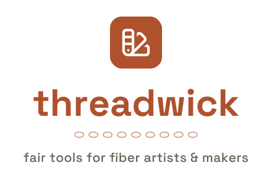
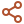

<p align="center">
	<picture>
		<source media="(prefers-color-scheme: dark)" srcset=".github/assets/banner-dark.svg">
		
	</picture>
</p>

Threadwick is a free home for fiber artists and makers: design crochet charts, keep your
patterns in one place, share them with the world — and follow other people's patterns stitch
by stitch.

**You don't need anything on this page to use Threadwick.** The app runs in your browser at
[**threadwick.com**](https://threadwick.com) — nothing to install.

##  What you get

-  **Design** — draw stitch charts round by round in the Studio editor.
-  **Keep** — organize patterns into projects, with your yarns, notes, and links alongside.
-  **Share** — publish patterns for anyone, or sell your own; when you handle the sale
  yourself, Threadwick takes nothing.
-  **Make** — follow a pattern in the built-in viewer and track your progress.
-  **Leave anytime** — export your work in open, portable formats. No lock-in.

Designing, charting, organizing, sharing, and cloud backup are free, always. Makers never pay
Threadwick anything.

##  Run it on your own computer

Threadwick is open source, so the curious can run the whole app locally. You'll need
[Node.js](https://nodejs.org) (version 22) and [pnpm](https://pnpm.io); then copy-paste:

```sh
git clone https://github.com/threadwick-hq/threadwick.git
cd threadwick
pnpm install
pnpm --filter threadwick-web dev
```

…and open <http://localhost:5173> in your browser. That's it.

##  Digging deeper

Everything technical — how the project is put together, setting up a development
environment, where the work is headed — lives in the
[**wiki**](https://github.com/threadwick-hq/threadwick/wiki). If you'd like to get involved,
start with [CONTRIBUTING.md](CONTRIBUTING.md).

##  License

Threadwick is free software under **[AGPL-3.0-or-later](LICENSE)**. Third-party icon notices
are in [NOTICE](NOTICE).
